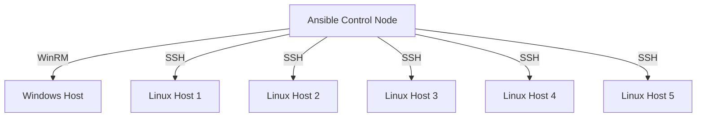

Here's a structured documentation format for your Ansible inventory file that you can add to GitHub:

---

# Ansible Inventory Configuration Guide

This document explains the structure and configuration of the Ansible inventory file for managing both Windows and Linux hosts.

## Inventory File Structure

```ini
[windows]
win-host ansible_host=0118968c302c.mylabserver.com

[windows:vars]
ansible_user=ansible
ansible_password=1qaz@WSX
ansible_connection=winrm
ansible_winrm_transport=basic
ansible_port=5985
ansible_winrm_server_cert_validation=ignore

[linux-hosts]
0118968c302c.mylabserver.com
0118968c303c.mylabserver.com
0118968c304c.mylabserver.com
0118968c305c.mylabserver.com
0118968c306c.mylabserver.com
```

## Section Breakdown

### 1. Windows Hosts Group
```ini
[windows]
win-host ansible_host=0118968c302c.mylabserver.com
```
- **Group Name**: `windows`  
  (Special group name recognized by Ansible for Windows hosts)
- **Host Entry**:
  - Alias: `win-host`
  - Actual FQDN: `0118968c302c.mylabserver.com`

### 2. Windows Configuration Variables
```ini
[windows:vars]
ansible_user=ansible
ansible_password=1qaz@WSX
ansible_connection=winrm
ansible_winrm_transport=basic
ansible_port=5985
ansible_winrm_server_cert_validation=ignore
```

| Variable | Value | Purpose |
|----------|-------|---------|
| `ansible_user` | ansible | Administrative account |
| `ansible_password` | 1qaz@WSX | Password for authentication |
| `ansible_connection` | winrm | Use Windows Remote Management |
| `ansible_winrm_transport` | basic | Authentication protocol |
| `ansible_port` | 5985 | WinRM HTTP port |
| `ansible_winrm_server_cert_validation` | ignore | Disable SSL cert verification |

### 3. Linux Hosts Group
```ini
[linux-hosts]
0118968c302c.mylabserver.com
0118968c303c.mylabserver.com
0118968c304c.mylabserver.com
0118968c305c.mylabserver.com
0118968c306c.mylabserver.com
```
- **Group Name**: `linux-hosts`  
  (Custom group name for Linux servers)
- **Host Entries**: 5 servers with sequential hostnames
- **Default Connection**: SSH (using current user's credentials)

## Connection Diagram



## Security Considerations

1. **Password in Plaintext**  
   **Risk**: Credentials exposed in inventory file  
   **Solution**: Use Ansible Vault or environment variables

2. **Certificate Validation**  
   **Risk**: `ansible_winrm_server_cert_validation=ignore` disables SSL verification  
   **Solution**: Configure proper certificates in production

3. **Basic Authentication**  
   **Risk**: Basic auth over HTTP is insecure  
   **Solution**: Use HTTPS (port 5986) with certificate-based auth

## Best Practices

1. **Credential Management**  
   ```yaml
   # Instead of plaintext passwords:
   ansible_user: "{{ vaulted_user }}"
   ansible_password: "{{ vaulted_password }}"
   ```

2. **Host Naming Convention**  
   Use descriptive names instead of sequential IDs:
   ```ini
   [web-servers]
   web01.prod.example.com
   web02.prod.example.com
   ```

3. **Group Variables**  
   Store Windows connection settings in `group_vars/windows.yml`

4. **Port Configuration**  
   For production Windows hosts:
   ```ini
   ansible_port=5986
   ansible_winrm_transport=ntlm
   ```

## Example Usage

1. Test Windows connection:
   ```bash
   ansible windows -m win_ping
   ```

2. Check Linux host disk space:
   ```bash
   ansible linux-hosts -m shell -a "df -h"
   ```

3. Run playbook on all hosts:
   ```bash
   ansible-playbook site.yml -i inventory.ini
   ```

---

This documentation format provides clear explanations while maintaining security awareness. You can add it to:
- `docs/INVENTORY.md`
- Repository Wiki
- Main `README.md` (condensed version)

Include appropriate warnings about credential security and SSL certificate validation in production environments.
